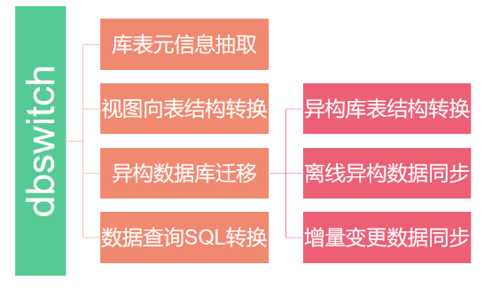
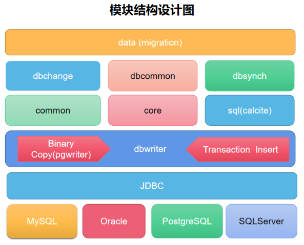
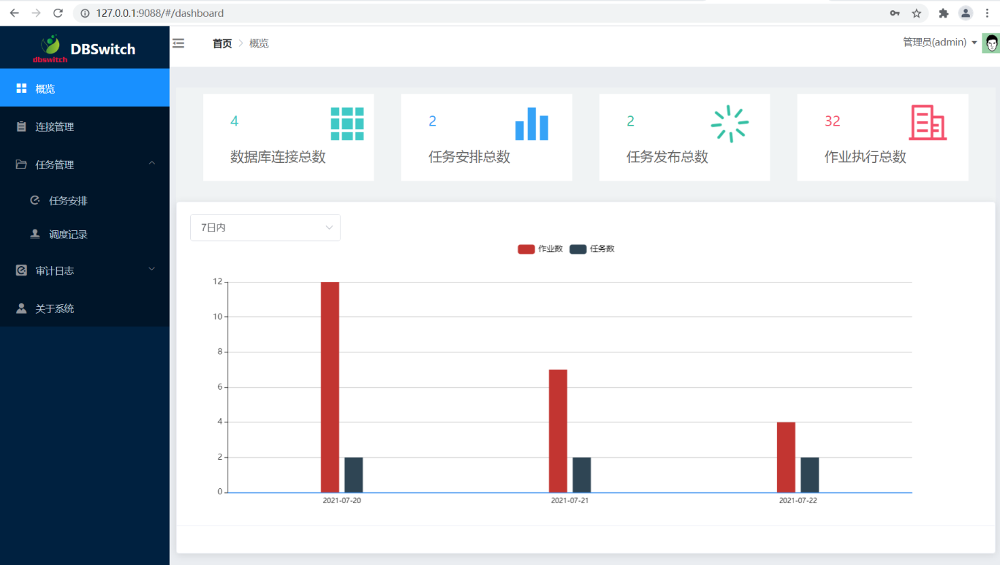
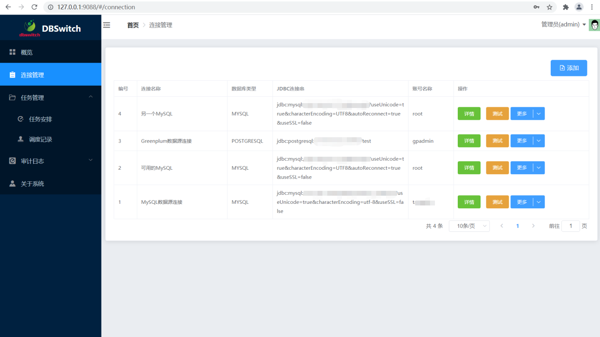
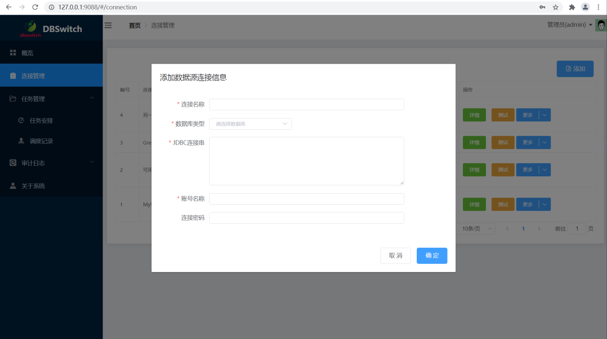
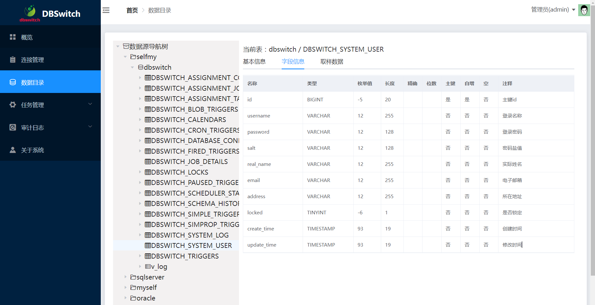
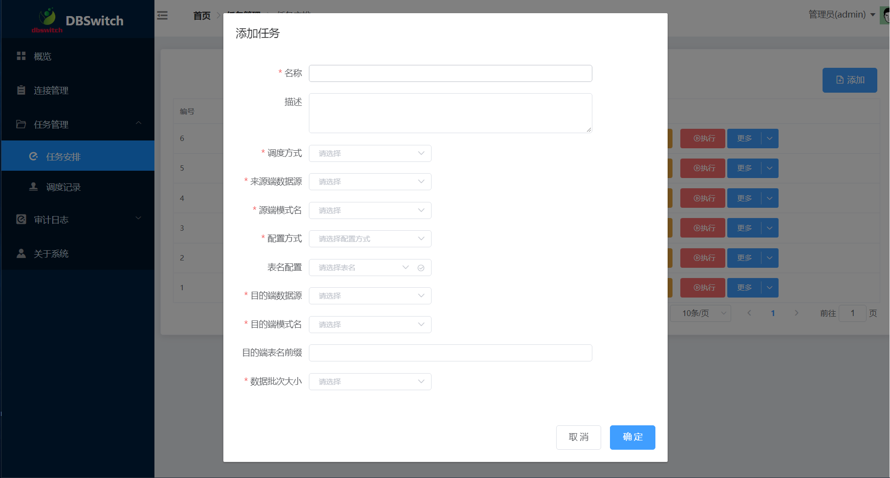
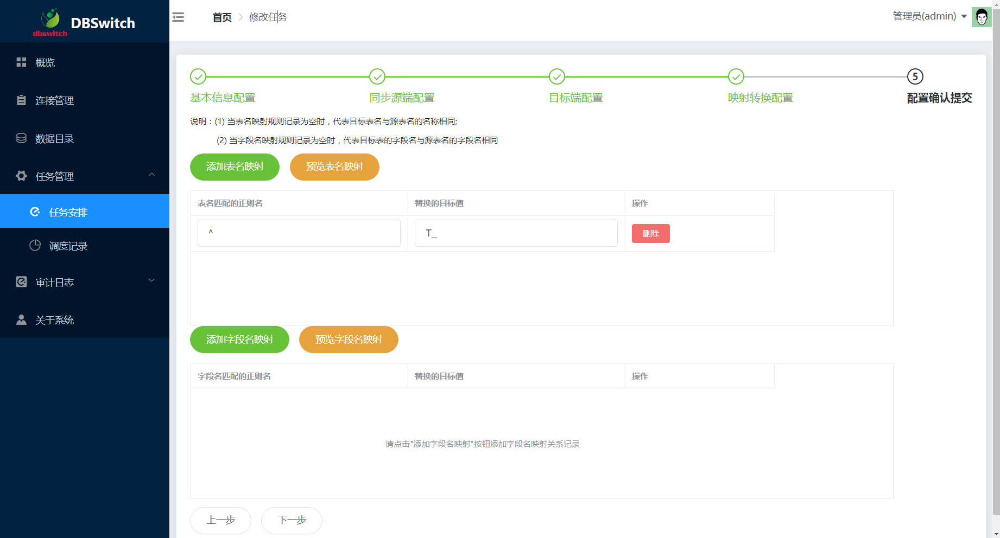
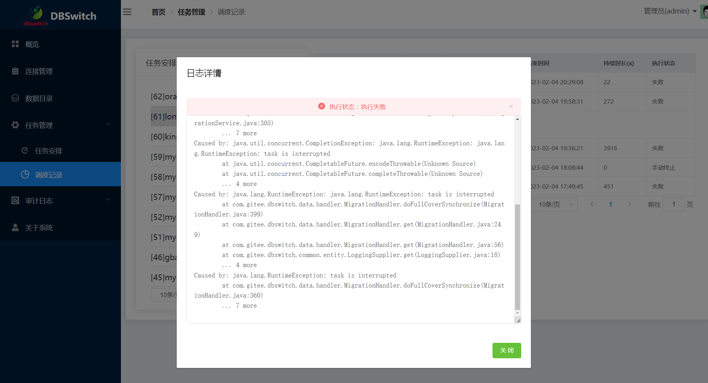

# 异构数据库数据与结构同步工具

## 一、工具介绍

### 1、功能描述

一句话，dbswitch工具提供源端数据库向目的端数据库的**批量**迁移同步功能，支持数据的全量和增量方式同步。包括：

- **结构迁移**

支持字段类型、主键信息、建表语句等的转换，并生成建表SQL语句。

支持基于正则表达式转换的表名与字段名映射转换。

- **数据同步**。

基于JDBC的分批次读取源端数据库数据，并基于insert/copy方式将数据分批次写入目的数据库。

支持有主键表的 **增量变更同步** （变化数据计算Change Data Calculate）功能(千万级以上数据量的性能尚需在生产环境验证)

### 2、功能设计

 
 
### 3、详细功能

- 源端oracle/SqlServer/MySQL/MariaDB/PostgreSQL/DB2/DM/Kingbase8/HighGo/Hive向目的端为Greenplum/PostgreSQL/HighGo的迁移(**支持绝大多数常规类型字段**)
 
- 源端oracle/SqlServer/MySQL/MariaDB/PostgreSQL/DB2/DM/Kingbase8/HighGo/Hive向目的端为Oracle的迁移(**支持绝大多数常规类型字段**)

- 源端oracle/SqlServer/MySQL/MariaDB/PostgreSQL/DB2/DM/Kingbase8/HighGo/Hive向目的端为DM的迁移(**支持绝大多数常规类型字段...**)

- 源端oracle/SqlServer/MySQL/MariaDB/PostgreSQL/DB2/DM/Kingbase8/HighGo/Hive向目的端为SQLServer的迁移(**字段类型兼容测试中...**)

- 源端oracle/SqlServer/MySQL/MariaDB/PostgreSQL/DB2/DM/Kingbase8/HighGo/Hive向目的端为MySQL/MariaDB的迁移(**字段类型兼容测试中...**)

- 源端oracle/SqlServer/MySQL/MariaDB/PostgreSQL/DB2/DM/Kingbase8/HighGo/Hive向目的端为DB2的迁移(**字段类型兼容测试中...**)

- 源端oracle/SqlServer/MySQL/MariaDB/PostgreSQL/DB2/DM/Kingbase8/HighGo/Hive向目的端为Kingbase8的迁移(**支持绝大多数常规类型字段...**)

** 注:** 目前Hive只支持账号密码方式认证。

### 4、结构设计
  
- 模块结构设计

  
  
- 模块结构功能 

```
└── dbswitch
    ├── dbswitch-common    // dbswitch通用定义模块
    ├── dbswitch-pgwriter  // PostgreSQL的二进制写入封装模块
    ├── dbswitch-dbwriter  // 数据库的通用批量Insert封装模块
    ├── dbswitch-core      // 数据库元数据抽取与建表结构语句转换模块
    ├── dbswitch-sql       // 基于calcite的DML语句转换与DDL拼接模块
    ├── dbswitch-dbcommon  // 数据库操作通用封装模块
    ├── dbswitch-dbchange  // 基于全量比对计算变更（变化量）数据模块
    ├── dbswitch-dbsynch   // 将dbchange模块计算的变更数据同步入库模块
    ├── dbswitch-data      // 工具入口模块，读取配置文件中的参数执行异构迁移同步
    ├── dbswitch-admin     // 在以上模块的基础上引入Quartz的调度服务与接口
    ├── dbswitch-admin-ui  // 基于Vue2的前段WEB交互页面
    ├── package-tool       // 基于maven-assembly-plugin插件的项目打包模块
```
 
## 二、编译打包

本工具纯Java语言开发，代码中的依赖全部来自于开源项目。

### 1、编译打包

- 环境要求:

  **JDK**:>=1.8
 
  **maven**:>=3.6
> Maven 仓库默认在国外， 国内使用难免很慢，可以更换为阿里云的仓库。 参考教程： [配置阿里云的仓库教程](https://www.runoob.com/maven/maven-repositories.html)

- 编译命令:

**(1) windows下：**

```
 双击build.cmd脚本文件即可编译打包
```

**(2) Linux下：**

```
git clone https://gitee.com/inrgihc/dbswitch.git
cd dbswitch/
sh ./build.sh
```

**(3) Docker下:**

```
git clone https://gitee.com/inrgihc/dbswitch.git
cd dbswitch/
sh ./docker-maven-build.sh
```

**特别注意：** 在Java9及以上版本默认情况下不允许应用程序查看来自JDK的所有类，但在dbswitch中利用反射计算对象的字节大小，所以需要在JVM启动时(bin/datasync.sh脚本)需要增加如下参数：
```
--add-opens java.base/jdk.internal.loader=ALL-UNNAMED --add-opens jdk.zipfs/jdk.nio.zipfs=ALL-UNNAMED
```

### 2、安装部署

(1) 当编译打包命令执行完成后，会在dbswitch/target/目录下生成dbswitch-relase-x.x.x.tar.gz的打包文件，将文件拷贝到已安装JRE的部署机器上解压即可。

(2) 基于docker-compose提供linux联网环境下的**一键安装**：

详见文档: [build-docker/install/README.md](build-docker/install) 

## 三、工具使用

> dbswitch工具提供基于```conf/config.yml```配置的启动方式和基于```conf/application.yml```的WEB端使用方式；

### 1、基于conf/config.yml配置启动的命令操作方式

#### (1)、配置文件

配置文件信息请见部署包中的：```conf/config.yml```（注：也同时支持使用```conf/config.properties```配置文件名的properties格式），示例配置如下：

```
dbswitch:
  source:
    # source database connection information
    ## support MySQL/MariaDB/DB2/DM/Kingbase8/Oracle/SQLServer/PostgreSQL/Greenplum
    ## support mutiple source database connection
    - url: jdbc:oracle:thin:@172.17.2.10:1521:ORCL
      driver-class-name: 'oracle.jdbc.driver.OracleDriver'
      username: 'system'
      password: '123456'
      # source database configuration parameters
      ## fetch size for query source database
      fetch-size: 10000
      ## schema name for query source schemas, separate by ','
      source-schema: 'TANG'
      ## table name include from table lists, separate by ','
      source-includes: ''
      ## table name exclude from table lists, separate by ','
      source-excludes: ''
      ## table name convert mapper by regular expression
      regex-table-mapper:
        - 'from-pattern': '^'
          'to-value': 'T_'
      ## columns name convert mapper by regular expression like regex-table-mapper
      regex-column-mapper:

  target:
    # target database connection information
    ## Best support for Oracle/PostgreSQL/Greenplum/DM/Kingbase8
    url: jdbc:postgresql://172.17.2.10:5432/test
    driver-class-name: org.postgresql.Driver
    username: tang
    password: 123456
    # target database configuration parameters
    ## schema name for create/insert table data
    target-schema: public
    ## whether drop-create table when target table exist
    target-drop: true
    ## whether create table support auto increment for primary key field
    create-table-auto-increment: false
    ## whether use insert engine to write data for target database
    ## Only useful for PostgreSQL/Greenplum database
    writer-engine-insert: false
    ## whether use change data synchronize to target database table
    change-data-sync: true
```

| 配置参数 | 配置说明 | 示例 | 备注 |
| :------| :------ | :------ | :------ |
| dbswitch.source[i].url | 来源端JDBC连接的URL | jdbc:oracle:thin:@10.17.1.158:1521:ORCL | 可为：oracle/mysql/mariadb/sqlserver/postgresql/db2/dm/kingbase8/highgo |
| dbswitch.source[i].driver-class-name | 来源端数据库的驱动类名称 | oracle.jdbc.driver.OracleDriver | 对应数据库的驱动类 |
| dbswitch.source[i].username | 来源端连接帐号名 | tangyibo | 无 |
| dbswitch.source[i].password | 来源端连接帐号密码 | tangyibo | 无 |
| dbswitch.source[i].fetch-size | 来源端数据库查询时的fetch_size设置 | 10000 | 需要大于100有效 |
| dbswitch.source[i].source-schema | 来源端的schema名称 | dbo,test | 多个之间用英文逗号分隔 |
| dbswitch.source[i].source-includes | 来源端schema下的表中需要包含的表名称 | users1,orgs1 | 支持多个表（多个之间用英文逗号分隔）；支持支持正则表达式(不能含有逗号) |
| dbswitch.source[i].source-excludes | 来源端schema下的表中需要过滤的表名称 | users,orgs | 不包含的表名称，多个之间用英文逗号分隔 |
| dbswitch.source[i].regex-table-mapper | 基于正则表达式的表名称映射关系 | [{"from-pattern": "^","to-value": "T_"}] | 为list类型，元素存在顺序关系 |
| dbswitch.source[i].regex-column-mapper | 基于正则表达式的字段名映射关系 | [{"from-pattern": "$","to-value": "_x"}] | 为list类型，元素存在顺序关系 |
| dbswitch.target.url | 目的端JDBC连接的URL | jdbc:postgresql://10.17.1.90:5432/study | 可为：oracle/sqlserver/postgresql/greenplum,mysql/mariadb/db2/dm/kingbase8/highgo也支持，但字段类型兼容性问题比较多 |
| dbswitch.target.driver-class-name |目的端 数据库的驱动类名称 | org.postgresql.Driver | 对应数据库的驱动类 |
| dbswitch.target.username | 目的端连接帐号名 | study | 无 |
| dbswitch.target.password | 目的端连接帐号密码 | 123456 | 无 |
| dbswitch.target.target-schema | 目的端的schema名称 | public | 目的端的schema名称只能有且只有一个 |
| dbswitch.target.target-drop | 是否执行先drop表然后create表命令,当target.datasource-target.drop=true时有效 | true | 可选值为：true、false |
| dbswitch.target.create-table-auto-increment | 是否执启用支持create表时主键自增 | true | 可选值为：true、false |
| dbswitch.target.writer-engine-insert | 是否使用insert写入数据 | false | 可选值为：true为insert写入、false为copy写入，只针对目的端数据库为PostgreSQL/Greenplum的有效 |
| dbswitch.target.change-data-sync | 是否启用增量变更同步，dbswitch.target.target-drop为false时且表有主键情况下有效,千万级以上数据量建议设为false | false | 可选值为：true、false |


 **注意:**
 
- （1）支持源端为多个数据源类型，如果```dbswitch.source[i]```为数组类型，i为编号，从0开始的整数； 
 
- （2）如果```dbswitch.source[i].source-includes```不为空，则按照包含表的方式来执行； 

- （3）如果```dbswitch.source[i].source-includes```为空，则按照```dbswitch.source[i].source-excludes```排除表的方式来执行。 

- （4）如果```dbswitch.target.target-drop=false```，```dbswitch.target.change-data-synch=true```；时会对有主键表启用增量变更方式同步 

- （5）对于```regex-table-mapper```和```regex-column-mappe```，为基于正则表达式替换的表名映射和字段名映射，均可以为空（代表原名映射，即源的表t_a映射到目的端也为t_a）

> 提示：如果要将源端所有表名添加前缀，可以配置```"from-pattern": "^","to-value": "T_"```;

- （6）各个数据库的JDBC驱动连接示例如下：

**mysql/mariadb的驱动配置样例**

```
jdbc连接地址：jdbc:mysql://172.17.2.10:3306/test?useUnicode=true&characterEncoding=utf-8&useSSL=false&zeroDateTimeBehavior=convertToNull&serverTimezone=Asia/Shanghai&nullCatalogMeansCurrent=true&tinyInt1isBit=false
jdbc驱动名称： com.mysql.jdbc.Driver
```

与:

```
jdbc连接地址：jdbc:mariadb://172.17.2.10:3306/test?useUnicode=true&characterEncoding=utf-8&useSSL=false&zeroDateTimeBehavior=convertToNull&serverTimezone=Asia/Shanghai&nullCatalogMeansCurrent=true&tinyInt1isBit=false
jdbc驱动名称： org.mariadb.jdbc.Driver
```

**oracle的驱动配置样例**

```
jdbc连接地址：jdbc:oracle:thin:@172.17.2.10:1521:ORCL  或   jdbc:oracle:thin:@//172.17.2.10:1521/ORCL
jdbc驱动名称：oracle.jdbc.driver.OracleDriver
```

**SqlServer(>=2005)的驱动配置样例**

```
jdbc连接地址：jdbc:sqlserver://172.17.2.10:1433;DatabaseName=hqtest
jdbc驱动名称：com.microsoft.sqlserver.jdbc.SQLServerDriver
```

**PostgreSQL/Greenplum的驱动配置样例**

```
jdbc连接地址：jdbc:postgresql://172.17.2.10:5432/study
jdbc驱动名称：org.postgresql.Driver
```

**DB2的驱动配置样例**

```
jdbc连接地址：jdbc:db2://172.17.2.10:50000/testdb:driverType=4;fullyMaterializeLobData=true;fullyMaterializeInputStreams=true;progressiveStreaming=2;progresssiveLocators=2;
jdbc驱动名称：com.ibm.db2.jcc.DB2Driver
```

**达梦DM的驱动配置样例**

```
jdbc连接地址：jdbc:dm://172.17.2.10:5236
jdbc驱动名称：dm.jdbc.driver.DmDriver
```

**人大金仓Kingbase8的驱动配置样例**

```
jdbc连接地址：jdbc:kingbase8://172.17.2.10:54321/MYTEST
jdbc驱动名称：com.kingbase8.Driver
```

**翰高HighGo数据库(可按PostgreSQL使用)**
 
```
jdbc连接地址：jdbc:postgresql://172.17.2.10:5866/highgo
jdbc驱动名称：org.postgresql.Driver
```

**Apache Hive数据库**
 
```
jdbc连接地址：jdbc:hive2://172.17.2.12:10000/default
jdbc驱动名称：org.apache.hive.jdbc.HiveDriver
```

#### (2)、启动方法

- linux系统下：

```
cd dbswitch-release-X.X.X/
bin/datasync.sh
```

- windows系统下：

```
切换到dbswitch-release-X.X.X/bin/目录下，双击datasync.cmd脚本文件即可启动
```

#### (3)、额外说明

- 1、对于向目的库为PostgreSQL/Greenplum的数据离线同步默认采用copy方式写入数据，说明如下：
  
  **（a）** 如若使用copy方式写入，配置文件中需配置为postgresql的jdbc url和驱动类（不能为greenplum的驱动包），
  
  **（b）** 如若使用insert方式写入，需要在config.properties配置文件中设置如下参数为true:

```
dbswitch.target.writer-engine-insert=true
```

- 2、dbswitch离线同步工具支持的数据类型包括：整型、时间、文本、二进制等常用数据类型;

- 3、Oracle的表虽然设置了主键，如果**主键约束实际为DISABLED状态**，那在进行结构转换时会按照没有此主键处理。

- 4、关于增量变更同步方式的使用说明

> 步骤A：先通过设置```dbswitch.target.target-drop=true```，```dbswitch.target.change-data-sync=false```；启动程序进行表结构和数据的全量同步;

> 步骤B：然后设置```dbswitch.target.target-drop=false```，```dbswitch.target.change-data-sync=true```；再启动程序对（有主键表）数据进行增量变更同步。

> 注：如果待同步的两端表结构已经一致或源端字段是目的端字段的子集，也可直接用步骤B配置进行变更同步

### 2、基于conf/application.yml配置启动的WEB使用方式

#### (1)、准备一个MySQL(建议为：版本为 5.7+ )的数据库

#### (2)、配置conf/application.yml

```
server:
  port: 9088

spring:
  application:
    name: dbswitch-admin
  tomcat:
    uri-encoding: UTF-8
    max-http-header-size: 8096
  mvc:
    throw-exception-if-no-handler-found: true
    static-path-pattern: /statics/**
  datasource:
    driver-class-name: com.mysql.jdbc.Driver
    url: jdbc:mysql://192.168.31.57:3306/dbswitch?createDatabaseIfNotExist=true&useUnicode=true&characterEncoding=UTF8&useSSL=false
    username: tangyibo
    password: 123456
    validation-query: SELECT 1
    test-on-borrow: true
  flyway:
    locations: classpath:db/migration
    baseline-on-migrate: true
    table: DBSWITCH_SCHEMA_HISTORY
    enabled: true

mybatis:
  configuration:
    lazy-loading-enabled: true
    aggressive-lazy-loading: false
    map-underscore-to-camel-case: true
    log-impl: org.apache.ibatis.logging.stdout.StdOutImpl

mapper:
  wrap-keyword: "`{0}`"
  enable-method-annotation: true
```

按照上述配置，修改```conf/application.yml```配置文件中的```spring.datasource.url```和```spring.datasource.username```及```spring.datasource.password```三个字段值的配置。

#### (3)、启动dbswitch-admin系统

- linux系统下：

```
cd dbswitch-release-X.X.X/
bin/startup.sh
```

- windows系统下：

```
切换到dbswitch-release-X.X.X/bin/目录下，双击startup.cmd脚本文件即可启动
```

#### (4)、补充说明

- dbswitch-admin的WEB端会根据用户的配置调用dbswitch-data模块执行数据迁移同步；

- dbswitch-admin服务启动时会基于flyway自动建库建表，需要保证配置的mysql连接账号具有建库建表等权限；

- dbswitch离线同步工具提供各种数据库间表结构转换RESTful类型的在线API接口如下:（详见[接口文档](/INTERFACE.md)）

> Swagger在线接口地址： http://127.0.0.1:9088/swagger-ui/

- WEB系统的访问如下：

> URL地址: ```htttp://127.0.0.1:9088``` 登陆账号：```admin```  登陆密码：```123456```

- WEB系统的使用流程为：

> 建立源端数据库的连接 -> 建立目的断数据库的连接  -> 配置任务  -> 发布任务  -> 手动/系统调度执行任务  -> 查看调度记录

- WEB系统的部分截图：

 
 
 
 
 
 
 
 
 
 
 

 

 

### 3、两种方式的适用场景

- 方式一：基于conf/config.yml配置启动的命令操作方式式   

**优点：**

> 当需要配置的表或字段等数量较大时，该方式便于在yml中配置；

> 只需一个配置文件即可进行启动执行任务；

**缺点：**

> 只能运行单个任务，任务执行完立即停止；

> 不支持CRON表达式的周期执行；

- 方式二：基于conf/application.yml配置启动的WEB使用方式

**优点：**

> 提供WEB操作来配置（方式一的YAML中的参数）,只需点击即可完成配置；

> 支持多个任务并发执行（在硬件资源足够的条件下）

> 支持CRON表达式的周期执行

**缺点：**

> 当数据库内的表或字段数量较大时，WEB方式卡顿严重；

> 多个任务并发执行不易于分析任务错误原因；


## 四、常见问题解决

### 1、执行启动脚本报错

- （1）在Windows下，执行startup.cmd或datasync.cmd脚本报错

> 解决办法：将脚本的内容复制后，删除原脚本文件，然后再创建一个同名脚本文件后，将原内容粘贴进去后，再执行脚本。

- （2）在Linux下，执行startup.sh或datasync.sh脚本报错

> 解决办法：用vi/vim工具打开脚本，然后命令模式下设置 ```set ff=unix```后，然后保存退出，再执行脚本。

## 五、文档博客

（1）https://blog.csdn.net/inrgihc/article/details/103739629

（2）https://blog.csdn.net/inrgihc/article/details/104642238

（3）https://blog.csdn.net/inrgihc/article/details/103932231

（4）https://blog.csdn.net/inrgihc/article/details/103738656

（5）https://blog.csdn.net/inrgihc/article/details/121447417

## 六、问题反馈

如果您看到并使用了本工具，或您觉得本工具对您有价值，请为此项目**点个赞**，以表示对本项目的支持，多谢！如果您在使用时遇到了bug，欢迎在issue中反馈。也可扫描下方二维码入群讨论：（加好友请注明："程序交流"）


